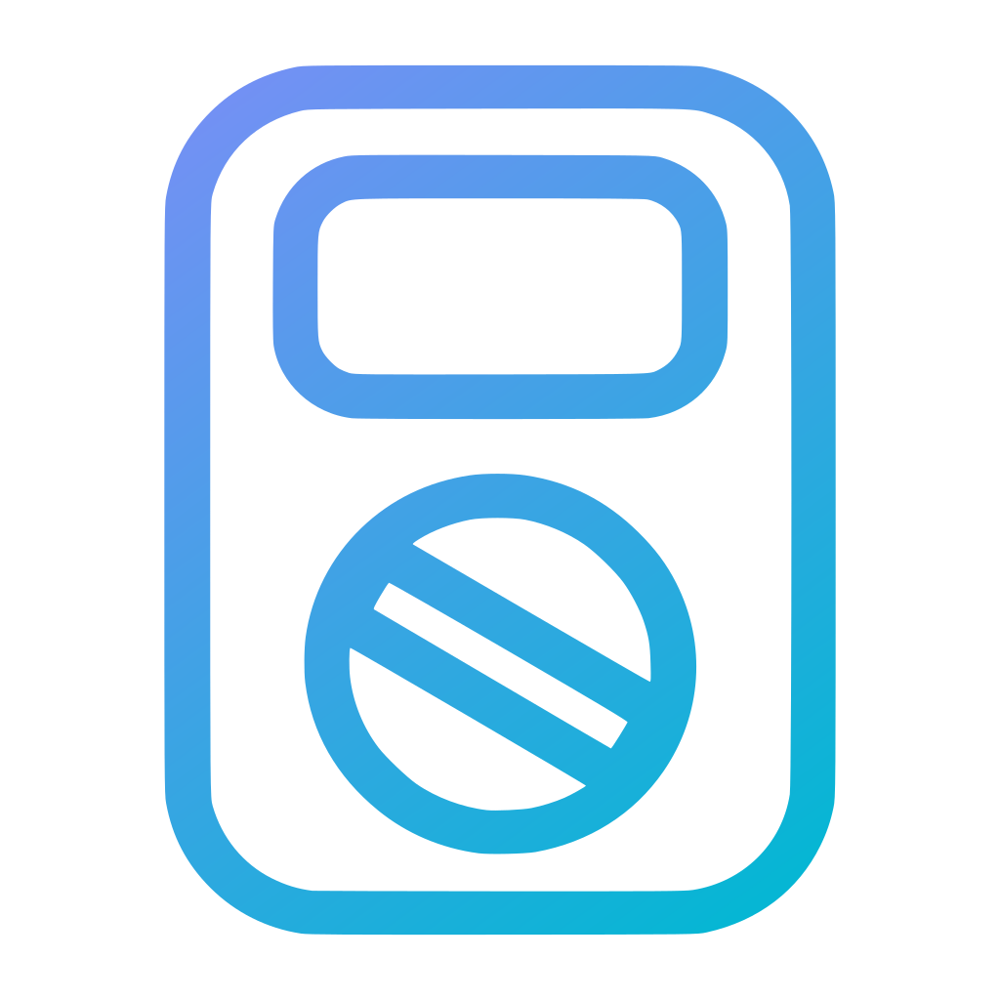
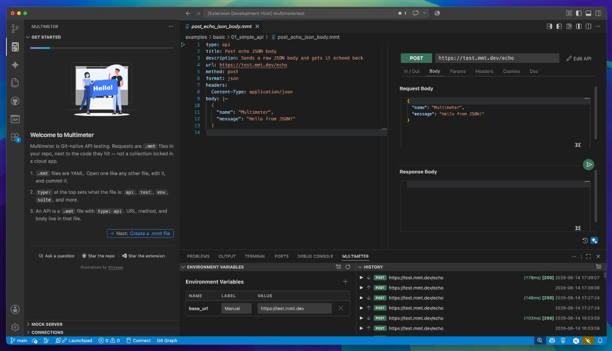

<div align="center">
  <a href="https://mmt.dev">
    
  </a>
  <h4> Start with a request. Grow into a testing platform. Never switch tools.</h4>
  <p>
    <a href="https://marketplace.visualstudio.com/items?itemName=mshobeyri.multimeter">
      
    </a>
    <a href="https://marketplace.visualstudio.com/items?itemName=mshobeyri.multimeter">
      
    </a>
    <a href="https://github.com/mshobeyri/multimeter/blob/main/LICENSE.md">
      
    </a>
  </p>
  <p>
    <a href="https://mmt.dev/demos"> View Demo</a>
    &middot;
    <a href="https://mmt.dev"> Website</a>
    &middot;
    <a href="https://github.com/mshobeyri/multimeter/issues/new?labels=enhancement&template=feature-request.md"> Request Feature</a>
  </p>
</div>

<p align="center">
  
</p>


## 🚀 The simplicity of Bruno. The power of Postman.

**Multimeter** combines the simplicity of Git-native tools with the power of a complete API testing platform.

Start with a single HTTP request.

Grow into tests, suites, mocks, reports, auto-generated documentation, and CI workflows when you need them.

All in the same tool. No migration required.

## 🫤 Tired of fighting your API testing tools?


### Coming from Postman?

- ✅ Powerful ecosystem
- ✅ Rich API tooling
- ✅ Collaboration features

- ❌ Huge collections
- ❌ JavaScript test scripts everywhere
- ❌ CI pipelines behaving differently than local runs
- ❌ Environment sprawl
- ❌ Tests tied to a platform
- ❌ Hidden state scattered across workspaces

### Coming from Bruno?

- ✅ Git-native
- ✅ Lightweight
- ✅ Simple

- ❌ Repeated request definitions
- ❌ Multi-step API workflows
- ❌ Large test suites
- ❌ Keeping mocks in sync
- ❌ CI reports
- ❌ Generated documentation

## 🎯 Why Multimeter?


**Everything developers love about Bruno**

- ✅ Git-native
- ✅ File-based
- ✅ Lightweight
- ✅ No cloud lock-in

**Everything teams eventually need as projects grow**

- ✅ API testing
- ✅ Test suites
- ✅ Mock servers
- ✅ Documentation
- ✅ Reports
- ✅ CI workflows

**Without switching tools. Without the usual tradeoff.**

| Tool | Tradeoff |
|--------|--------|
| Postman | Powerful but heavy |
| Bruno | Simple but limited |
| Multimeter | Simple by default. Powerful when needed. |

[See all features →](https://mmt.dev/#features)


## ⚡ Start simple

Multimeter is a VS Code-native extension. All you need:
- Click Install button in [Multimeter VS Code Extension](https://marketplace.visualstudio.com/items?itemName=mshobeyri.multimeter)
- Open **Get Started** from the `Activity bar` and follow the instructions

There you run a POST request as follows:

```yaml
type: api
title: Simple POST
url: https://test.mmt.dev/echo
method: post
format: json
body:
  message: hello
```

That's enough.

- No suites.
- No mocks.
- No workflows.
- No complexity.


## 🧪 Need tests?

```yaml
type: test
steps:
  - http: https://test.mmt.dev/echo
    method: get
    expect:
      status: 200
```

- Still simple.
- Still Git-native.
- Still easy to review.


## 🚀 Scale without switching tools

As your project grows, Multimeter grows with it.

Add:

- Test suites
- Mock servers
- Documentation
- Workflow execution
- Structured reporting
- CI artifacts

**Only when you need them.**

Everything stays in the same ecosystem.

[See all examples →](./examples)


## 🔁 Built for reliable CI

Multimeter validates test definitions before execution.

That means:

- ✅ Earlier feedback
- ✅ More deterministic execution
- ✅ Fewer surprises in CI
- ✅ Easier debugging
- ✅ Reproducible results


## 📦 Everything stays in Git

Your code, tests, mocks, documentation, reports, and environment settings live in the same repository.

- ✅ Version controlled
- ✅ Code and tests evolve together
- ✅ Reviewable through pull requests
- ✅ Easy to move and share
- ✅ No platform lock-in
- ✅ AI can update code and tests together
- ✅ Environment variables never go missing
- ✅ Historical test results stay with the project


## 🧠 Philosophy

Most API tools focus on requests.

Multimeter focuses on behavior.

Instead of asking:

> "Did this request return the expected response?"

Multimeter helps you answer:

> "Does this system still behave correctly?"

---

[Demos](https://mmt.dev/demos) · [Documentation](./docs/toc.md) · [Website](https://mmt.dev) · [GitHub](https://github.com/mshobeyri/multimeter)